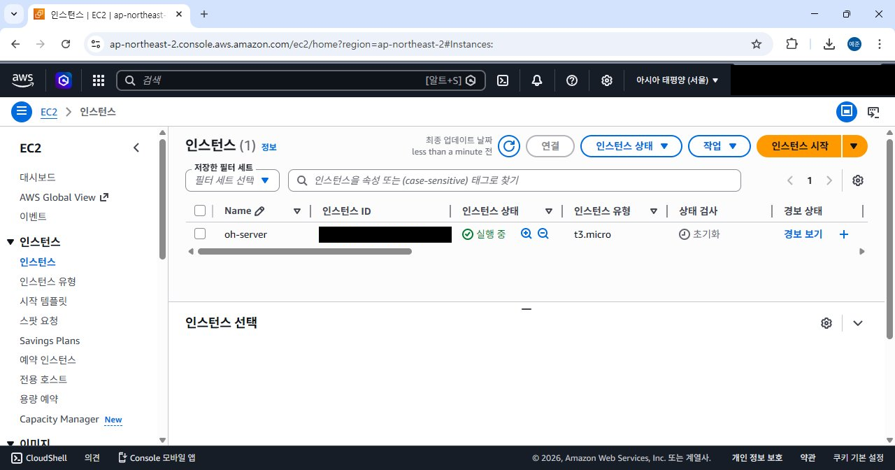
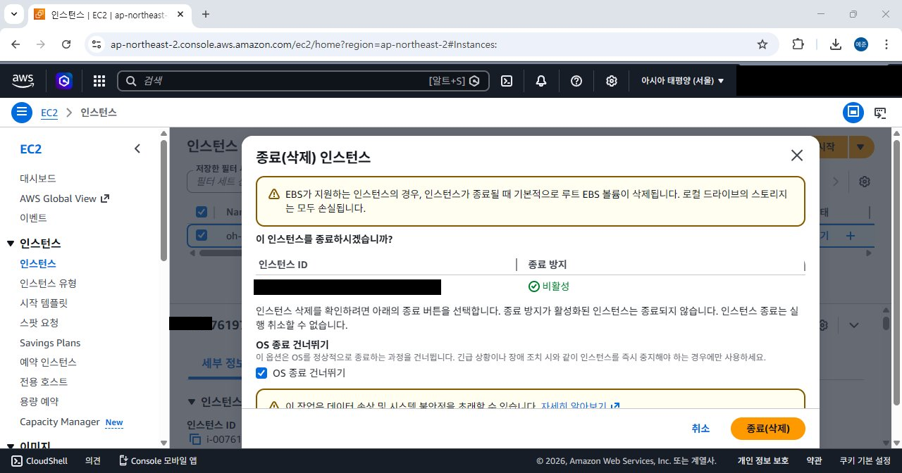
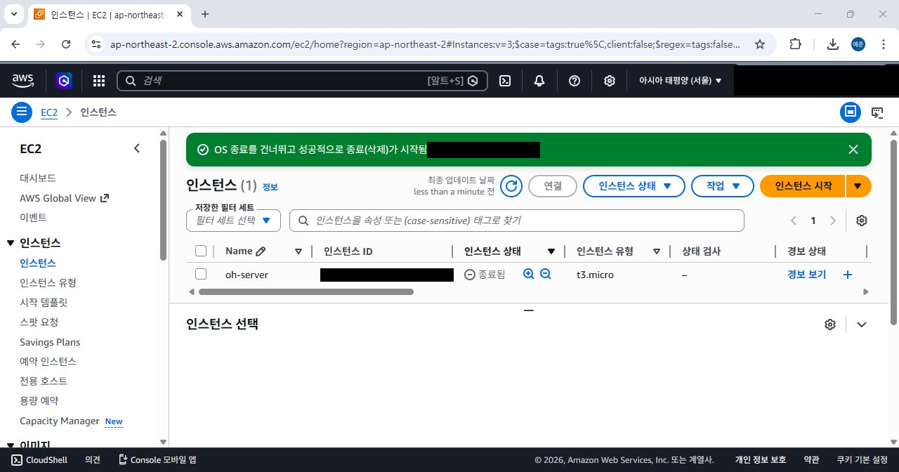
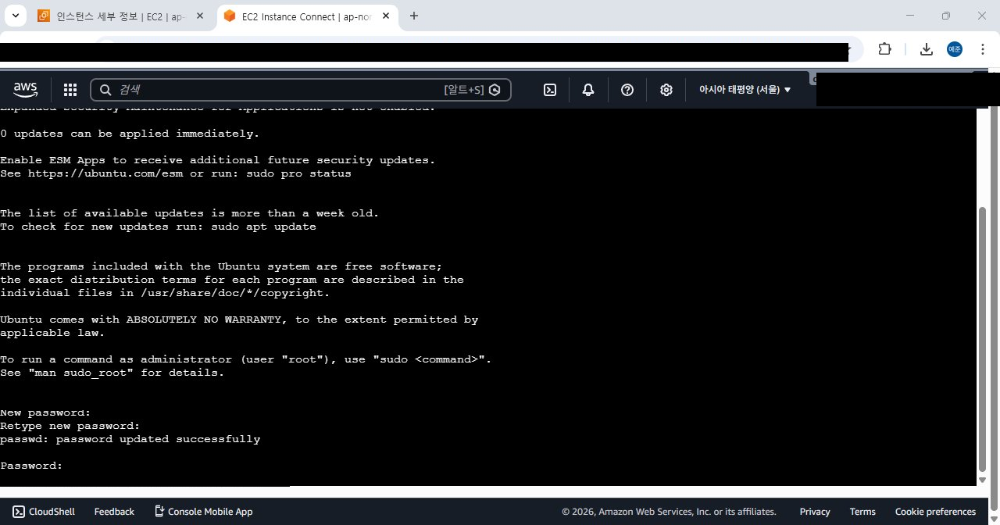

# 1주차 - 클라우드 개요

[← 목차로 돌아가기](../README.md)

---

## AWS 계정 생성 및 EC2 인스턴스 생성

[https://aws.amazon.com/ko/](https://aws.amazon.com/ko/) 에서 AWS 계정을 생성하고, EC2 콘솔에서 첫 인스턴스를 생성했다.

- 인스턴스 이름: `oh-server`
- 인스턴스 유형: `t3.micro`
- 가용 영역: `ap-northeast-2` (서울 리전)


> 인스턴스 `oh-server`가 정상적으로 **실행 중** 상태임을 확인했다.

---

## EC2 인스턴스 삭제

실습 완료 후, 불필요한 과금 방지를 위해 인스턴스를 종료(삭제)했다.

EC2 콘솔 → 인스턴스 선택 → 작업 → **인스턴스 종료(삭제)**


> 종료(삭제) 확인 창. EBS 루트 볼륨도 함께 삭제된다는 경고가 표시된다.  
> 종료 방지가 **비활성** 상태인 경우에만 종료가 가능하다.


> 종료(삭제) 완료. 인스턴스 상태가 **종료됨**으로 변경되었다.

> ⚠️ **중지(Stop)** 는 일시 중단, **종료(Terminate)** 는 영구 삭제다.  
> 종료 후에는 복구가 불가능하며, 연결된 EBS 볼륨도 기본적으로 함께 삭제된다.

---

## root 계정 전환

EC2 Instance Connect를 통해 인스턴스에 접속한 후, root 계정 비밀번호를 설정하고 전환했다.  
Ubuntu Server 초기 설치 시 root 계정은 비활성화 상태이므로, 아래 순서로 활성화했다.

```bash
$ sudo passwd root
```

`passwd` 명령으로 root 비밀번호를 새로 설정한다.

```bash
$ su
```

`su` 명령으로 root 계정으로 전환한다. 프롬프트가 `$`에서 `#`으로 바뀌면 전환 성공이다.


> `passwd: password updated successfully` 메시지 확인 후 `su` 명령으로 root 전환.  
> 프롬프트가 `ubuntu@...~$` → `root@...:/home/ubuntu#` 으로 변경되었다.

| 프롬프트 | 의미 |
|---------|------|
| `$` | 일반 사용자 |
| `#` | 관리자 (root) |

---

> **(Demo)** AWS EC2 인스턴스와 프라이빗 클라우드(OpenStack) 네트워크 연결 — 영상 시청으로 대체  
> **(Demo)** 가상머신 Ping Test (13:11~) — 영상 시청으로 대체
