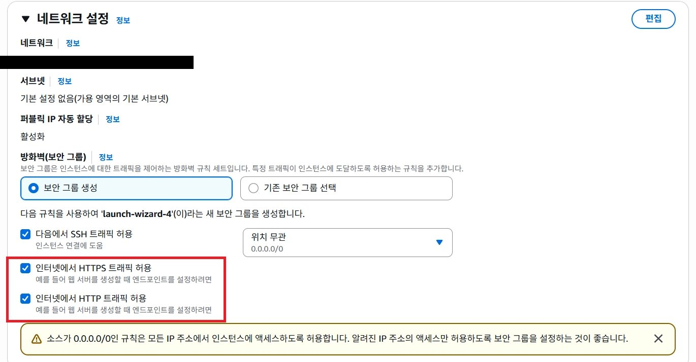
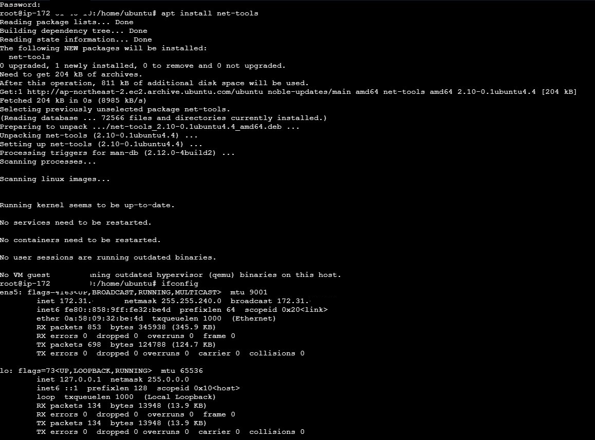
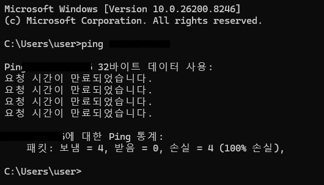
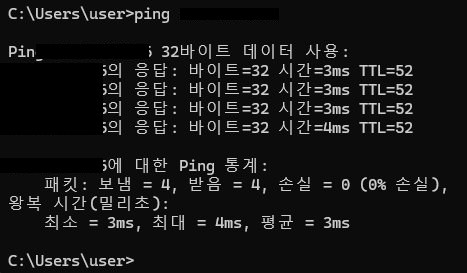
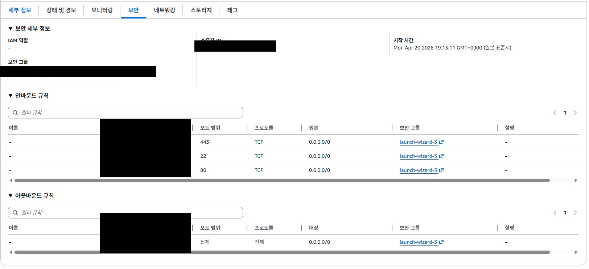
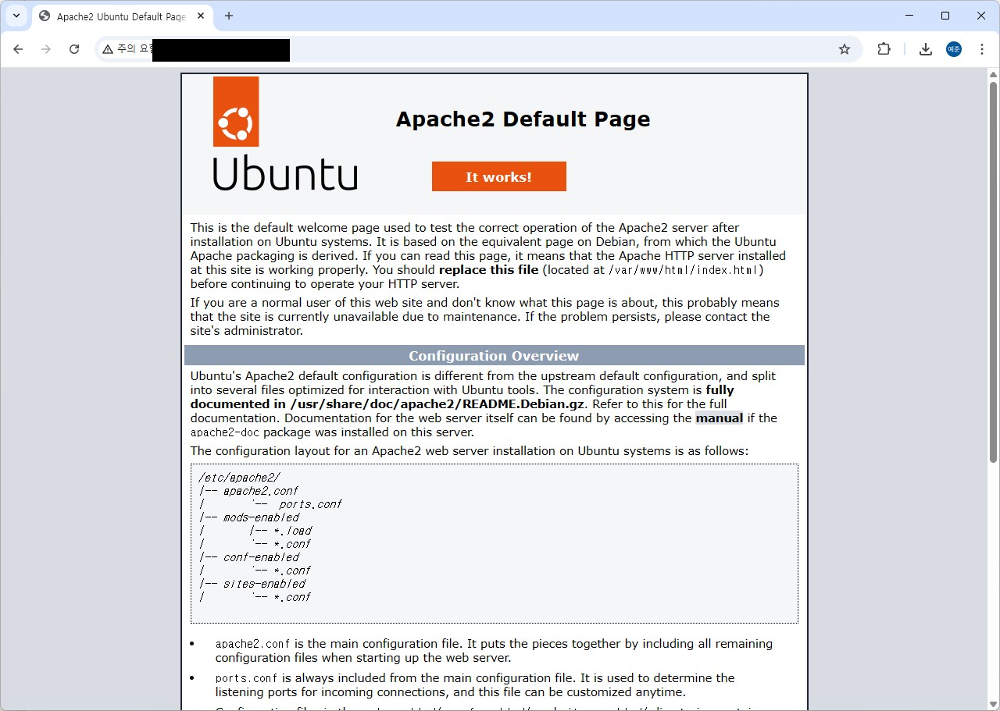
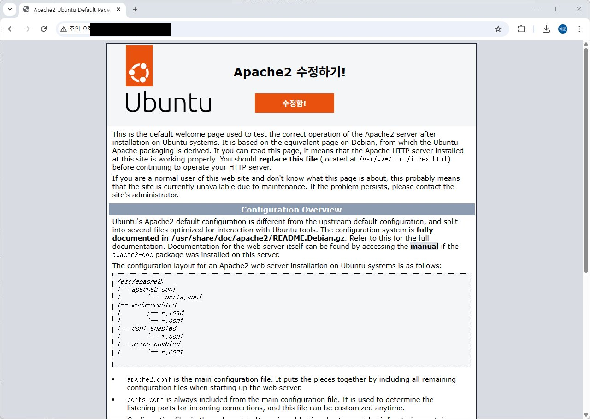

# 2주차 - AWS 컴퓨팅 서비스

[← 목차로 돌아가기](../README.md)

---

## AMI를 이용한 EC2 인스턴스 배포

AWS 콘솔에서 AMI(Amazon Machine Image)를 기반으로 EC2 인스턴스를 생성했다.  
네트워크 설정에서 VPC, 서브넷, 보안 그룹을 지정한다.


> 웹 서버 실습을 위해 HTTP/HTTPS 트래픽 허용 규칙을 인바운드에 추가했다.  
> `0.0.0.0/0` 규칙은 모든 IP의 접근을 허용하므로, 실습 이후에는 규칙을 제한하는 것이 권장된다.

생성된 인스턴스에 접속해 root 전환 후 아래 명령을 실행했다.

```bash
$ sudo passwd root
$ su

# apt install net-tools
# ifconfig
```

`net-tools` 패키지를 설치하면 `ifconfig` 명령으로 인스턴스에 할당된 ENI와 IP 주소를 확인할 수 있다.


> `ens5` 인터페이스에 Private IP가 할당된 것을 확인했다.

| IP 종류 | 설명 |
|--------|------|
| Public IP | 외부에서 인스턴스에 접속할 때 사용. SSH, 웹 브라우저 등 |
| Private IP | VPC 내부 통신 전용. 외부에 노출되지 않아 보안에 유리 |

> 💡 인스턴스를 **중지 후 재시작**하면 Public IP가 변경된다.  
> IP를 고정하려면 **탄력적 IP(Elastic IP)** 를 할당받아 인스턴스에 연결해야 한다.

---

## 외부에서 Ping Test

보안 그룹(Security Group)은 AWS의 가상 방화벽으로, 기본 설정에서는 외부 Ping 요청에 응답하지 않는다.


> 인바운드 규칙 추가 전 — 패킷 4개 전송, 응답 0개 (100% 손실).

외부 트래픽을 허용하려면 **인바운드 규칙**에 ICMP 허용 규칙을 추가해야 한다.


> HTTP (TCP 80) 인바운드 규칙 추가.


> 인바운드 규칙 추가 후 — 응답 시간 3~4ms, 0% 손실로 정상 응답 확인.

---

## SSH를 통한 EC2 인스턴스 원격 접속 및 웹 서버 설치

**SSH(Secure Shell)** 는 네트워크 상의 원격 시스템에 암호화된 통신으로 접속하는 프로토콜이다.  
AWS 관리 콘솔의 Instance Connect와 동일하게 동작하지만, 키 기반의 안정적인 작업 환경을 직접 구축할 수 있다.

PuTTY를 사용하는 경우 AWS에서 발급한 `.pem` 키페어를 PuTTYgen으로 `.ppk` 형식으로 변환한 후 접속한다.

보안 탭에서 인바운드/아웃바운드 규칙을 확인할 수 있다.


> SSH(22), HTTPS(443), HTTP(80) 인바운드 허용 규칙과 전체 아웃바운드 허용 규칙이 설정된 상태.

접속 후 Apache2 웹 서버를 설치하고 동작을 확인했다.

```bash
# sudo apt-get update
# sudo apt-get upgrade
# sudo apt install apache2

# sudo ufw allow http
# sudo ufw allow https

# systemctl start apache2
```

웹 브라우저에서 인스턴스의 Public IP로 접속하면 Apache2 기본 페이지가 표시된다.


> 설치 직후 기본 페이지 — "Apache2 Default Page / It works!" 확인.

```bash
# sudo service apache2 stop      # 웹 서버 중지
# sudo systemctl restart apache2  # 웹 서버 재시작
```

---

## Apache2 웹 서버 페이지 수정

```bash
# cd /var/www/html
# vim index.html
```

`/var/www/html` 은 Apache2가 사용자에게 제공하는 파일을 모아두는 기본 디렉터리다.  
`index.html` 을 수정하면 웹 브라우저에서 변경된 내용이 바로 반영된다.

| vim 명령 | 동작 |
|---------|------|
| `i` | 편집 모드 진입 |
| `:wq` | 저장 후 종료 |
| `:q!` | 저장 없이 종료 |


> `index.html` 수정 후 — 제목이 "Apache2 수정하기!", 버튼이 "수정함!"으로 변경된 것을 확인했다.
